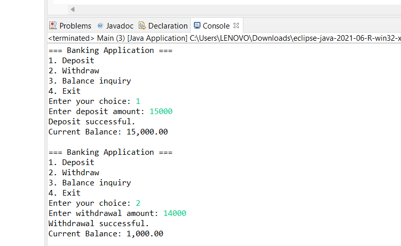
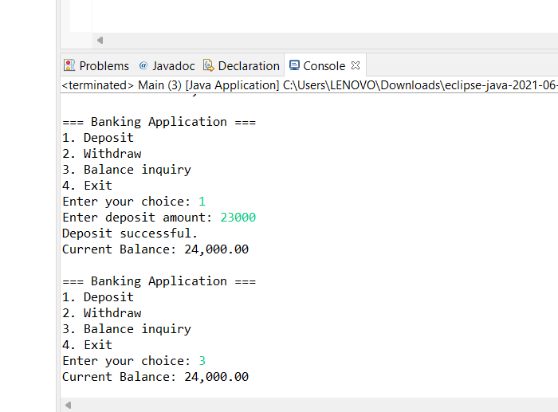
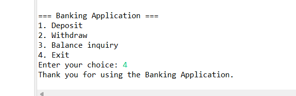

# Java Week 1 Assignment

This repository brings together three Java projects: a banking console application, a collections challenge, and a servlet based library management web application.

## Projects

| Project | What it demonstrates | Details |
| --- | --- | --- |
| Banking application | Deposits, withdrawals, balance checks, validation, and insufficient funds handling | banking_application/ |
| Java collections challenge | ArrayList task list, HashMap student directory, and FIFO queue | java_collections_challenge/ |
| Library management system | Java Servlets, JDBC, DAO and service layers, HTML pages | library_management_system/ |

## Screenshots

Eclipse Console screenshots provided for the banking application:

See main_README.md for setup notes. Each project has its own README with details and run instructions.
